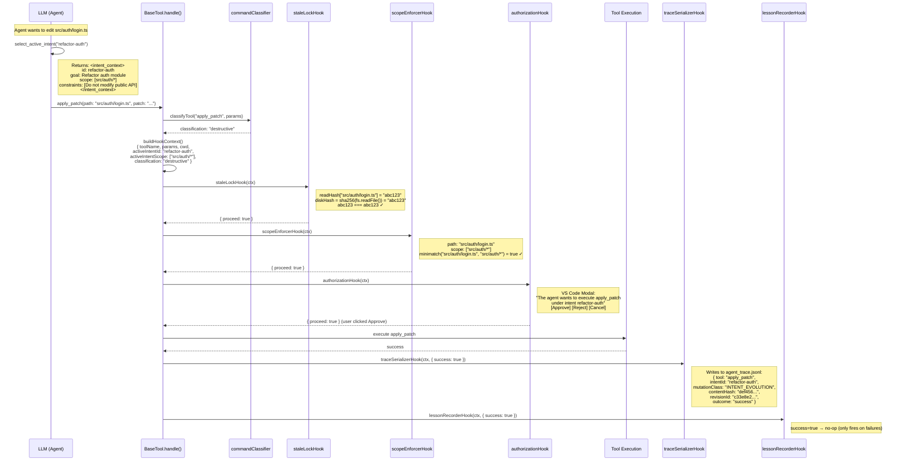
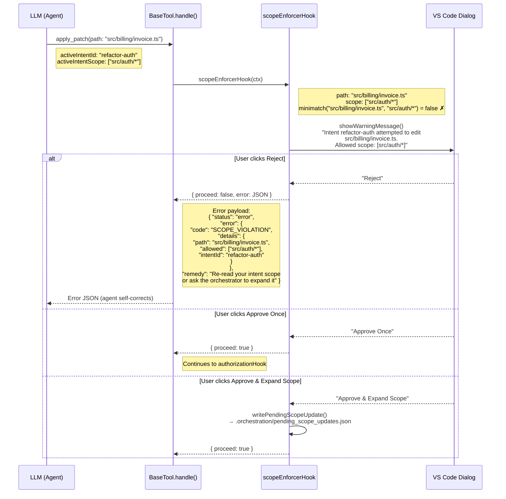
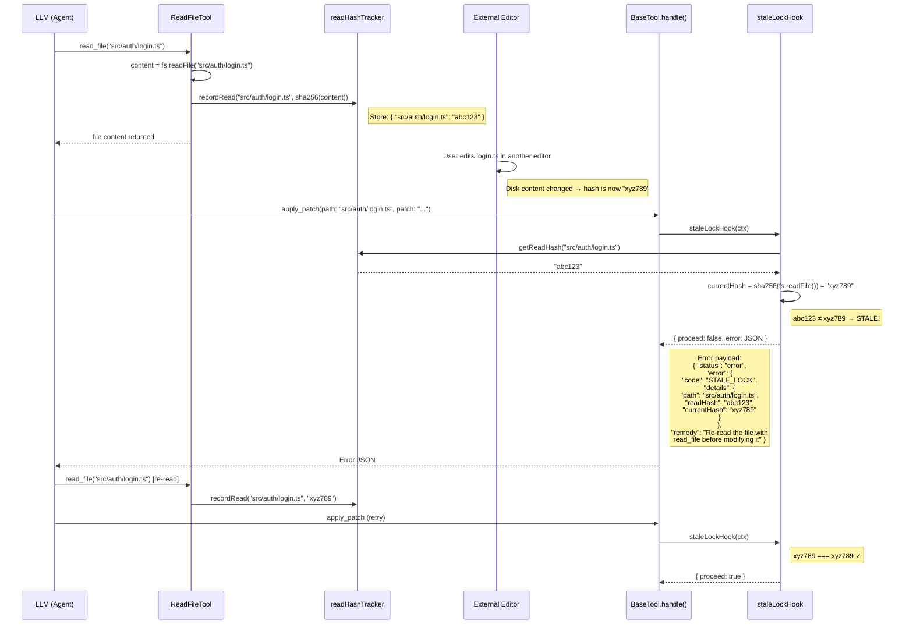
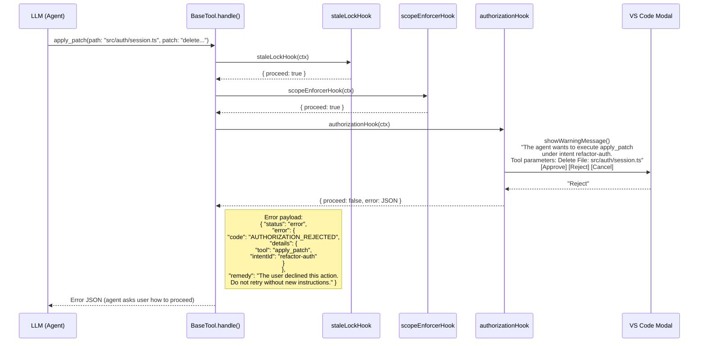
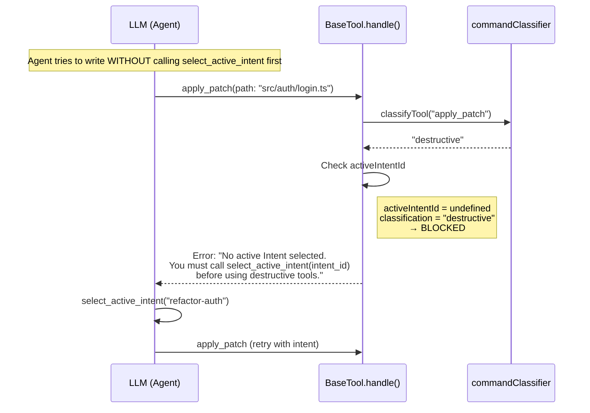
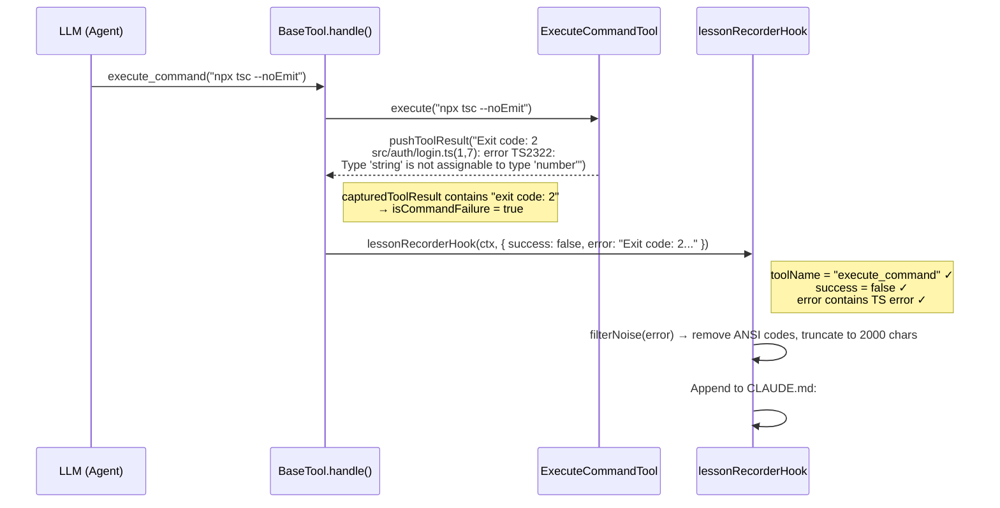
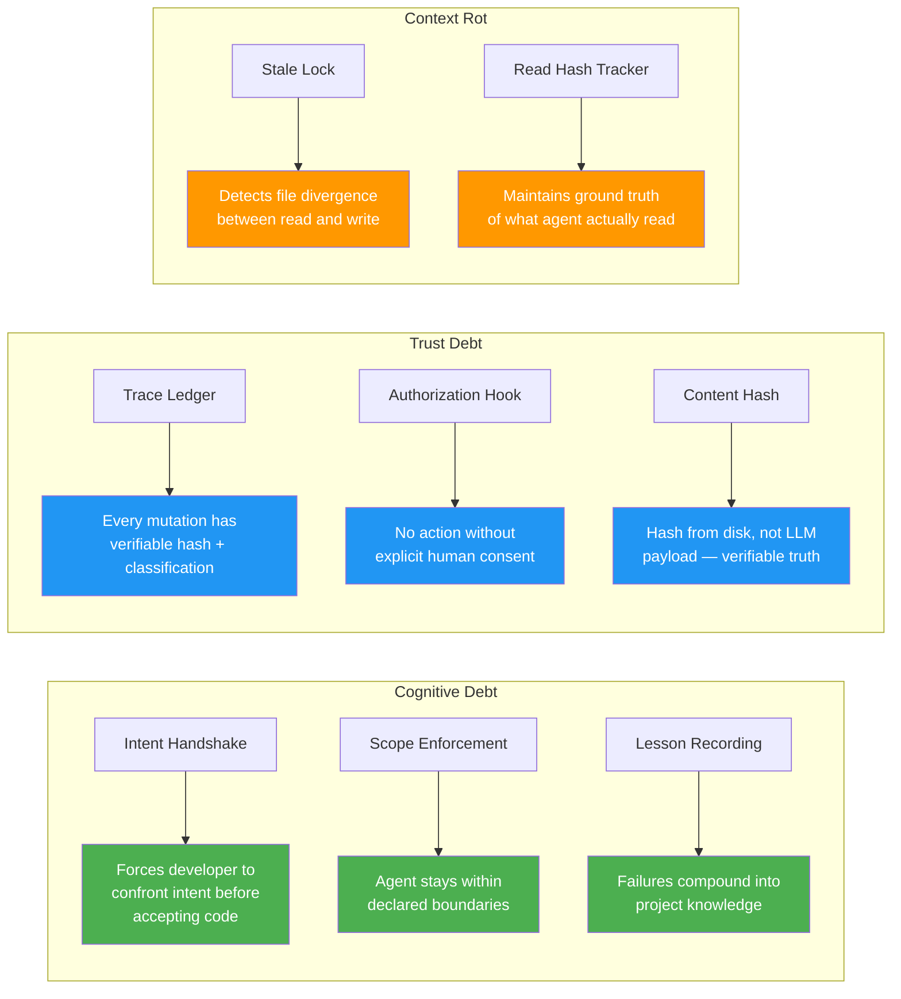

# AI-Native Git Layer — Complete Implementation Report

## Executive Summary

The **Intent-Driven Governance Layer** is a middleware system built into Roo-Code that provides formal control over AI agent actions. It directly addresses three systemic problems in AI-assisted development:

| Problem | Definition | How This System Addresses It |
|---------|-----------|------------------------------|
| **Cognitive Debt** | Silent divergence between what a developer intends and what the AI agent does | Intent Handshake forces the agent to declare its objective; constraints are injected into every tool call |
| **Trust Debt** | Accumulated opacity where developers can no longer verify what the agent changed or why | Append-only trace ledger records every mutation with content hashes and classification |
| **Context Rot** | Model context diverges from actual project state due to stale reads or concurrent edits | Optimistic locking via read-hash tracking detects and blocks stale writes |

The system was implemented across 4 phases, producing **20 source files**, **3 test suites** with **49 passing tests**, and a controlled test harness for validation.

---

## 1. Architecture Overview

### 1.1 System Flow — Happy Path



### 1.2 Failure Path — Scope Violation



### 1.3 Failure Path — Stale Lock Detection



### 1.4 Failure Path — Authorization Rejection



### 1.5 Failure Path — Missing Intent



### 1.6 Post-Hook — Lesson Recording (Command Failure)



---

## 2. Detailed Schemas

### 2.1 Intent Configuration — `active_intents.yaml`

**Location:** `.orchestration/active_intents.yaml` (workspace root)
**Owned by:** Human developer (manually created/edited)
**Read by:** `activeIntents.ts` on intent selection, `scopeEnforcer.ts` for scope loading
**Update trigger:** Manual edit by developer or orchestrator agent

```yaml
intents:
  - id: "refactor-auth"                  # string — Unique intent identifier
    goal: "Refactor authentication..."     # string — Injected into agent system prompt
    status: IN_PROGRESS                    # enum: IN_PROGRESS | PAUSED | DONE
    constraints:                           # string[] — Injected as behavioral rules
      - "Do not modify public API"
      - "Preserve existing function signatures"
    scope:                                 # string[] — Glob patterns for file access
      - "src/auth/*"
```

**Field semantics:**

| Field | Type | Purpose | Consumed By |
|-------|------|---------|-------------|
| `id` | `string` | Unique key, referenced in trace entries and hook context | `select_active_intent`, `traceSerializerHook`, `scopeEnforcerHook` |
| `goal` | `string` | Human-readable objective, injected into LLM system prompt | `select_active_intent` (context injection) |
| `status` | `"IN_PROGRESS" \| "PAUSED" \| "DONE"` | Only `IN_PROGRESS` intents can be selected | `select_active_intent` (gatekeeper validation) |
| `constraints` | `string[]` | Behavioral rules injected as `<intent_context>` XML block | `select_active_intent` (system prompt injection) |
| `scope` | `string[]` | Glob patterns for `minimatch` — defines writable file paths | `scopeEnforcerHook` (pre-hook enforcement) |

### 2.2 Agent Trace Entry — `agent_trace.jsonl`

**Location:** `.orchestration/agent_trace.jsonl` (workspace root)
**Owned by:** `traceSerializerHook` (post-hook, write-only)
**Read by:** `mutationClassifier.ts` (on first classification call)
**Update trigger:** Every successful file write (post-hook fires after tool execution)

```typescript
interface AgentTraceEntry {
    id: string              // UUIDv4 — unique entry identifier
    timestamp: string       // ISO-8601 — when the write occurred
    tool: string            // Tool name that performed the mutation
    intentId: string        // Active intent ID at time of write (from HookContext)
    mutationClass:          // Classification computed by mutationClassifier
        "INTENT_EVOLUTION"  //   → First write to this file by this intent
      | "AST_REFACTOR"      //   → Subsequent write to same file by same intent
    mutationType:           // Type of file operation
        "WRITE"             //   → File created or modified
      | "DELETE"            //   → File removed
    filePath: string        // Canonical relative POSIX path (via canonicalizePath)
    contentHash: string     // SHA-256 hex digest of disk content AFTER write
    outcome:                // Execution result
        "success"           //   → Write completed without error
      | "error"             //   → Write failed
    error?: string          // Error message (present only when outcome === "error")
    revisionId?: string     // git rev-parse HEAD at time of write (cached per session)
    fileSizeBytes?: number  // File size in bytes after write (forensic debugging)
    toolArgsSnapshot?: {    // Safe subset — path only, NEVER content (privacy)
        path: string
    }
}
```

**Example entries (real output from demo):**
```json
{"id":"00a0acfb-2f51-4838-8075-c49c1fe0f32f","timestamp":"2026-02-21T12:30:34.890Z","tool":"apply_patch","intentId":"refactor-auth","mutationClass":"INTENT_EVOLUTION","mutationType":"WRITE","filePath":"src/auth/login.ts","contentHash":"2260425336409405572643dad174f8c0ac164a8a1ec431c9a4a7caf20856d406","outcome":"success","revisionId":"c33e8e26f6e893ef77d0ef729620b4dc29835c67","fileSizeBytes":2847,"toolArgsSnapshot":{"path":"src/auth/login.ts"}}
{"id":"7e60c1d5-b0b6-4131-9ab0-c715bcd33621","timestamp":"2026-02-21T15:06:21.426Z","tool":"apply_patch","intentId":"refactor-auth","mutationClass":"AST_REFACTOR","mutationType":"WRITE","filePath":"src/auth/login.ts","contentHash":"ffc660359e1470a0dcb7d99c80dfd931ff553298911a62bb740b1b5871a56909","outcome":"success","revisionId":"c33e8e26f6e893ef77d0ef729620b4dc29835c67","fileSizeBytes":2843,"toolArgsSnapshot":{"path":"src/auth/login.ts"}}
```

Note how `intentId` in the trace entry **directly references** the `id` field from `active_intents.yaml`. The `mutationClass` transitions from `INTENT_EVOLUTION` to `AST_REFACTOR` for the same `intentId::filePath` pair.

### 2.3 Hook Context — `HookContext`

**Owned by:** `HookEngine.buildHookContext()` (constructed before hook chain)
**Consumed by:** All 5 hooks

```typescript
interface HookContext {
    toolName: string                    // "apply_patch", "execute_command", etc.
    params: Record<string, unknown>     // Raw tool parameters from LLM
    cwd: string                         // Workspace root directory
    activeIntentId?: string             // Currently selected intent (from Phase 1)
    activeIntentScope?: string[]        // Scope globs loaded from YAML
    classification?: ToolClassification // "safe" | "sensitive" | "destructive"
}
```

### 2.4 Hook Result — `HookResult`

**Returned by:** Pre-hooks to `HookEngine`
**Consumed by:** `BaseTool.handle()` → either proceeds or returns error to LLM

```typescript
interface HookResult {
    proceed: boolean    // true = allow tool execution, false = block
    error?: string      // JSON error payload for LLM autonomous recovery
    reason?: string     // Human-readable reason for logging/UI
}
```

**Error payload structure** (when `proceed: false`):
```json
{
    "status": "error",
    "message": "Human-readable description",
    "error": {
        "code": "SCOPE_VIOLATION | AUTHORIZATION_REJECTED | STALE_LOCK | PATH_TRAVERSAL",
        "details": { /* context-specific fields */ }
    },
    "remedy": "Actionable instruction for the LLM to self-correct"
}
```

### 2.5 Tool Classification

```typescript
type ToolClassification = "safe" | "sensitive" | "destructive"
```

| Classification | Tools | Hook Behavior |
|---------------|-------|--------------|
| `safe` | `read_file`, `list_files`, `search_files`, `list_code_definition_names` | **Bypasses all hooks** — no enforcement |
| `sensitive` | Reading `.env`, `.pem`, `*secret*`, `*credential*` files | Authorization dialog shown, **no scope check** |
| `destructive` | `write_to_file`, `apply_patch`, `apply_diff`, `execute_command`, `delete_file` | **Full enforcement**: stale lock → scope → authorization → trace |

### 2.6 Mutation Classification

| Class | Cache Lookup | Meaning |
|-------|-------------|---------|
| `INTENT_EVOLUTION` | Key `"refactor-auth::src/auth/login.ts"` NOT in `priorWrites` Set | First write by this intent to this file — scope is expanding |
| `AST_REFACTOR` | Key `"refactor-auth::src/auth/login.ts"` IS in `priorWrites` Set | Iterating on already-modified code |

**Cache lifecycle:**
1. First call to `classifyMutation()` → reads `agent_trace.jsonl`, builds `Set<"intentId::filePath">` from all entries with `outcome==="success"` AND `mutationType==="WRITE"`
2. After each trace write → `recordWrite(intentId, filePath)` updates cache in-memory
3. On extension restart → cache resets to `null`, re-reads ledger on next call

---

## 3. Hook-by-Hook Specification

### 3.1 Pre-Hook 1: `staleLockHook` — Optimistic Concurrency Control

**File:** `src/hooks/staleLockHook.ts`
**Addresses:** **Context Rot** — prevents the agent from overwriting files that changed after its last read

| Property | Value |
|----------|-------|
| **Input** | `HookContext` with `params.path` (target file path) |
| **Output** | `HookResult` — `{ proceed: true }` or `{ proceed: false, error: STALE_LOCK JSON }` |
| **Triggers on** | Any destructive tool targeting a file that was previously read |
| **Writes to** | Nothing (read-only check) |
| **State dependency** | `readHashTracker` module-level `Map<string, string>` |
| **Fail condition** | `sha256(currentDisk) !== storedReadHash` |

**State management:**
- `recordRead(path, hash)` — called by `ReadFileTool.executeNew()` after reading content
- `getReadHash(path)` — returns stored hash or `undefined` (file never read)
- `clearRead(path)` — called by `traceSerializerHook` after successful write
- `clearAllReads()` — resets all tracking (extension restart)

### 3.2 Pre-Hook 2: `scopeEnforcerHook` — Path-Based Access Control

**File:** `src/hooks/scopeEnforcer.ts`
**Addresses:** **Cognitive Debt** — forces the agent to stay within its declared intent boundaries

| Property | Value |
|----------|-------|
| **Input** | `HookContext` with `activeIntentScope` and `params.path` |
| **Output** | `HookResult` — proceed or `SCOPE_VIOLATION` / `PATH_TRAVERSAL` error |
| **Triggers on** | Destructive tools with extractable file paths |
| **Writes to** | `.orchestration/pending_scope_updates.json` (on "Approve & Expand" only) |
| **State dependency** | `.intentignore` patterns (loaded fresh each check) |

**Path validation pipeline:**
1. `extractTargetPath(params)` — extracts path from `PATH_PARAM_KEYS: ["path", "file_path", "filePath", "filename"]`
2. `normaliseAndValidatePath(path, cwd)` — resolves to canonical relative POSIX path
3. Path traversal check — reject if resolved path escapes workspace root
4. `.intentignore` check — skip scope enforcement for exempted paths
5. `isPathInScope(path, scope)` — `minimatch` against each scope glob

### 3.3 Pre-Hook 3: `authorizationHook` — Human-in-the-Loop Gate

**File:** `src/hooks/authorizationHook.ts`
**Addresses:** **Trust Debt** — ensures no destructive action occurs without explicit human consent

| Property | Value |
|----------|-------|
| **Input** | `HookContext` with `toolName`, `activeIntentId`, `params` |
| **Output** | `HookResult` — proceed or `AUTHORIZATION_REJECTED` error |
| **Triggers on** | All `destructive` and `sensitive` tool classifications |
| **Writes to** | Nothing |
| **State dependency** | None (stateless — always shows dialog) |

**Dialog content:**
```
[Intent Governance] The agent wants to execute "{toolName}"
under intent "{activeIntentId}".

Tool parameters: {formatted params}

Do you approve this action?
[Approve] [Reject] [Cancel]
```

### 3.4 Post-Hook 1: `traceSerializerHook` — Audit Ledger

**File:** `src/hooks/traceSerializerHook.ts`
**Addresses:** **Trust Debt** — creates an immutable, verifiable record of every mutation

| Property | Value |
|----------|-------|
| **Input** | `HookContext` + `outcome: { success, error }` |
| **Output** | Void (fire-and-forget) |
| **Triggers on** | Successful writes by tools in `WRITE_TOOLS` or `DELETE_TOOLS` |
| **Writes to** | `.orchestration/agent_trace.jsonl` (append-only) |
| **Reads** | File content from disk (for `sha256` hash), `git rev-parse HEAD` |

**Computation chain:**
1. `extractTargetPath(params)` → canonical file path
2. `sha256(await fs.readFile(filePath))` → content hash from **actual disk**, not tool payload
3. `classifyMutation(cwd, intentId, filePath)` → `INTENT_EVOLUTION` or `AST_REFACTOR`
4. `getGitRevision(cwd)` → cached `git rev-parse HEAD`
5. `fs.appendFile(TRACE_LEDGER_PATH, JSON.stringify(entry) + "\n")`
6. `recordWrite(intentId, filePath)` → update mutation classifier cache
7. `clearRead(filePath)` → reset stale lock tracking for this file

### 3.5 Post-Hook 2: `lessonRecorderHook` — Failure Learning

**File:** `src/hooks/lessonRecorderHook.ts`
**Addresses:** **Cognitive Debt** — encodes failure patterns so they compound into project knowledge

| Property | Value |
|----------|-------|
| **Input** | `HookContext` + `outcome: { success: false, error: string }` |
| **Output** | Void (fire-and-forget) |
| **Triggers on** | `execute_command` failures with non-zero exit codes |
| **Writes to** | `CLAUDE.md` (workspace root, append-only) |
| **Dedup** | `Set<string>` keyed by `sha256(errorMessage)` — same error recorded once per session |

**Processing pipeline:**
1. Guard: `ctx.toolName !== "execute_command"` → return
2. Guard: `outcome.success === true` → return
3. Guard: dedup check — skip if error hash already recorded
4. `filterNoise(error)` → strip ANSI escape codes
5. `truncate(error, 2000)` → cap length
6. `extractCommand(error)` → pull command from output
7. `appendFile("CLAUDE.md", formattedLesson)`

---

## 4. File Inventory with Ownership

### Core Hook System (`src/hooks/`)

| File | Phase | Writes To | Read By | Purpose |
|------|-------|-----------|---------|---------|
| `types.ts` | 2 | — | All hooks | Type definitions: `HookContext`, `HookResult`, `PreHookFn`, `PostHookFn` |
| `HookEngine.ts` | 2 | — | `BaseTool.ts` | Orchestrates pre/post hook chains, builds context |
| `commandClassifier.ts` | 2 | — | `HookEngine.ts` | Classifies tools as safe/sensitive/destructive |
| `scopeEnforcer.ts` | 2 | `pending_scope_updates.json` | `HookEngine.ts` | Glob-based scope enforcement + path traversal prevention |
| `authorizationHook.ts` | 2 | — | `HookEngine.ts` | VS Code modal for user consent |
| `toolError.ts` | 2 | — | All blocking hooks | Structured JSON error builder with `errorCode` + `remedy` |
| `intentIgnore.ts` | 2 | — | `scopeEnforcer.ts` | `.intentignore` file parsing (like `.gitignore`) |
| `pendingScopeUpdates.ts` | 2 | `pending_scope_updates.json` | Orchestrator agent | Persists scope expansion proposals |
| `pathNormalize.ts` | 3 | — | `scopeEnforcer.ts`, `traceSerializerHook.ts` | Canonical POSIX path normalization |
| `contentHash.ts` | 3 | — | `traceSerializerHook.ts`, `readHashTracker.ts`, `staleLockHook.ts` | `sha256(content)` utility |
| `traceSchema.ts` | 3 | — | `traceSerializerHook.ts`, `mutationClassifier.ts` | `AgentTraceEntry` interface + `WRITE_TOOLS`/`DELETE_TOOLS` constants |
| `mutationClassifier.ts` | 3 | — (in-memory cache) | `traceSerializerHook.ts` | `INTENT_EVOLUTION` vs `AST_REFACTOR` classification |
| `traceSerializerHook.ts` | 3 | `agent_trace.jsonl` | `HookEngine.ts` | Append-only audit ledger writer |
| `readHashTracker.ts` | 4 | — (in-memory `Map`) | `staleLockHook.ts`, `ReadFileTool.ts` | Stores SHA-256 of last-read file content |
| `staleLockHook.ts` | 4 | — | `HookEngine.ts` | Blocks stale writes (optimistic concurrency) |
| `lessonRecorderHook.ts` | 4 | `CLAUDE.md` | `HookEngine.ts` | Records command failures as lessons |
| `index.ts` | — | — | External consumers | Barrel export |

### Modified Core Files

| File | Change | Why |
|------|--------|-----|
| `src/core/tools/BaseTool.ts` | `handle()` wraps `pushToolResult`, orchestrates pre/post hooks | `ExecuteCommandTool` handles failures internally without throwing — wrapping captures exit-code failures for `lessonRecorderHook` |
| `src/core/tools/ReadFileTool.ts` | Calls `recordRead()` after reading | Required for stale lock tracking |
| `src/core/context/activeIntents.ts` | Loads YAML, manages active intent state | Phase 1 intent selection and context injection |

### Test Suites

| File | # Tests | Coverage |
|------|---------|----------|
| `src/hooks/__tests__/HookEngine.spec.ts` | Phase 2 | Hook chain execution, fail-fast, context building, classification |
| `src/hooks/__tests__/phase3.spec.ts` | Phase 3 | Trace serialization, mutation classification, path normalization, content hashing |
| `src/hooks/__tests__/phase4.spec.ts` | Phase 4 | Read hash tracking, stale lock detection/bypass, lesson recording, dedup, noise filtering |

---

## 5. Design Decisions with Justification

| Decision | Rationale | Problem Domain Reference |
|----------|-----------|-------------------------|
| **YAML-based intents over SQLite** | Human-editable, version-controllable (`git diff` friendly), no binary dependency. A developer can review intent changes in a PR. | Reduces **Cognitive Debt** — intents are visible in the same repo as code |
| **Append-only JSONL trace** | Never loses data, no rotation needed, easy to `grep`/`jq`. Survives crashes (no transaction commit). | Addresses **Trust Debt** — immutable audit trail, no retroactive editing |
| **SHA-256 content hash (not file mtime)** | `mtime` is unreliable across filesystems (FAT32 has 2s resolution, network mounts may not propagate). SHA-256 provides content-addressable verification. | Prevents **Context Rot** — agent verifies actual content, not metadata |
| **Pre-hook fail-fast chain** | First failing hook stops execution immediately. No partial writes. Reduces surface area for race conditions. | Minimizes **Trust Debt** — blocked means blocked, no ambiguity |
| **Structured JSON errors to LLM** | LLM receives `errorCode`, `message`, `remedy` — can autonomously retry (e.g., re-read file, select different intent). | Reduces **Cognitive Debt** — agent recovers without human re-prompting |
| **Fail-open on hook errors** | If a hook itself crashes (not a policy violation, but a bug), it logs a warning and allows execution. Design choice: user productivity > enforcement perfection. | **Trade-off**: Slightly increases Trust Debt risk, but prevents the governance system from becoming a blocker during development |
| **Module-level caches** | `priorWrites` (mutation classifier), `readHashes` (stale lock) are session-scoped. Reset on extension restart. | **Trade-off**: No cross-session memory, but simplicity outweighs persistence complexity for v1 |
| **Content hash from disk, not tool payload** | `traceSerializerHook` reads the file AFTER the write completes, hashing actual disk content. This catches any filesystem-level transformations (encoding normalization, etc.) | Addresses **Trust Debt** — the hash reflects what's actually on disk, not what the LLM intended |
| **Post-hook `pushToolResult` capture in BaseTool** | `ExecuteCommandTool` handles non-zero exit codes internally (calls `pushToolResult` with error text) without throwing. Wrapping `pushToolResult` in `BaseTool.handle()` detects `exit code: N` patterns. | **Deviation from plan**: Originally expected tools to throw on failure. Discovered this assumption was wrong during Phase 4 debugging. |

---

## 6. Trade-offs, Limitations, and Deviations

### Known Limitations

| Limitation | Impact | Mitigation |
|-----------|--------|-----------|
| **Scope enforcement for `apply_patch`** | `apply_patch` embeds file paths in patch content, not as a separate `path` parameter. `scopeEnforcerHook` cannot extract the path reliably. | The authorization hook still catches all writes. LLM-level scope awareness (via system prompt injection) prevents most violations proactively. |
| **Module-level cache persistence** | `mutationClassifier` cache survives extension reloads (hot-reload) but not full restarts. May cause `AST_REFACTOR` when `INTENT_EVOLUTION` is expected if trace was cleared without restart. | Document that clearing `agent_trace.jsonl` requires a full Dev Host restart. |
| **Single-workspace assumption** | Intent governance assumes a single workspace root. Multi-root workspaces are not explicitly supported. | Could be extended by keying caches on workspace URI. |
| **No cross-agent intent locking** | Two agents in parallel can both select the same intent. No mutex/semaphore for intent ownership. | Future phase: add intent reservation with expiry in YAML or a lock file. |

### Deviations from Original Plan

| Original Plan | Actual Implementation | Reason |
|--------------|----------------------|--------|
| Tools throw on failure → post-hooks detect via `try/catch` | `BaseTool.handle()` wraps `pushToolResult` to capture exit-code failures | `ExecuteCommandTool` handles errors internally without throwing — discovered during Phase 4 debugging |
| `CLAUDE.md` in `.orchestration/` folder | `CLAUDE.md` at workspace root | Convention: `CLAUDE.md` is a standard Anthropic file expected at root. Could be changed. |
| Scope violation always shows dialog | LLM proactively refuses out-of-scope writes before hook fires | The LLM received scope information via system prompt injection (Phase 1), making it scope-aware. This is actually better — two layers of defense. |

---

## 7. Achievement Summary & Reflective Analysis

### 7.1 Honest Inventory — What Was Built

| Component | Status | Evidence |
|-----------|--------|----------|
| Intent Handshake (`select_active_intent`) | ✅ Fully implemented | Agent calls it before every destructive action; returns `<intent_context>` XML block |
| Scope Enforcement (`scopeEnforcerHook`) | ✅ Fully implemented | Blocks writes outside scope with 3-option dialog; `.intentignore` support |
| Authorization Gate (`authorizationHook`) | ✅ Fully implemented | VS Code modal for all destructive/sensitive tools |
| Trace Ledger (`traceSerializerHook`) | ✅ Fully implemented | Appends to `agent_trace.jsonl` with content hash, Git revision, classification |
| Mutation Classifier | ✅ Fully implemented | `INTENT_EVOLUTION` → `AST_REFACTOR` transition verified in demo |
| Stale Lock (`staleLockHook`) | ✅ Fully implemented | Blocks writes to externally-modified files; verified manually |
| Lesson Recording (`lessonRecorderHook`) | ✅ Fully implemented | Appends failures to `CLAUDE.md`; dedup and noise filtering working |
| Scope extraction for `apply_patch` | ⚠️ Partial | Path embedded in patch content not extracted; mitigated by LLM-level awareness + auth hook |
| Cross-agent intent locking | ❌ Not attempted | Out of scope for v1 — would require file-based mutex |
| Multi-root workspace support | ❌ Not attempted | Would require refactoring cache keys; not a priority |

### 7.2 Debt Mapping — How Each Component Repays Technical Debt



### 7.3 Technical Lessons Learned

These are specific, implementation-level lessons — not generic observations.

1. **Tool error handling is not uniform across Roo-Code tools.** `ExecuteCommandTool` handles non-zero exit codes internally by calling `pushToolResult` with the error text, rather than throwing an exception. This means `BaseTool.handle()`'s `try/catch` never fires for command failures. The fix — wrapping `pushToolResult` to capture output — is a pattern that would apply to any other tool with similar internal error handling.

2. **Stateless prompt re-assembly in Roo-Code means context injection must be idempotent.** The system prompt is re-assembled on every API call. Our Phase 1 intent context injection needed to avoid duplicate `<intent_context>` blocks. We solved this by injecting only once during `select_active_intent` and storing the state in the tool instance.

3. **Module-level state in TypeScript survives VS Code extension hot-reloads.** `let priorWrites: Set<string> | null = null` in `mutationClassifier.ts` persists across window reloads because the Node.js module cache isn't cleared. This caused confusion during testing (clearing the JSONL file didn't reset the classifier). Lesson: session-scoped state needs an explicit reset hook, or must be read from disk on every call.

4. **The LLM's proactive scope awareness is more powerful than reactive hook blocking.** Because Phase 1 injects scope information into the system prompt, the LLM itself refuses to write outside scope — the `scopeEnforcerHook` rarely fires. This creates a two-layer defense that's more robust than either layer alone.

5. **Content hashes should always come from disk, not from tool payloads.** The LLM-generated content may differ from what's actually written (encoding normalization, line-ending conversion, etc.). By hashing `fs.readFile()` output after the write, the trace reflects ground truth.

### 7.4 Concrete Next Steps

| Priority | Task | Effort | Debt Addressed |
|----------|------|--------|---------------|
| High | Extract file paths from `apply_patch` patch content for scope enforcement | 2 hours | Cognitive Debt |
| High | Add `resetClassifierCache()` call on workspace folder change/reload | 30 min | Context Rot |
| Medium | Cross-agent intent reservation (file-based lock with expiry) | 4 hours | Trust Debt |
| Medium | VS Code toast notifications for trace writes and lesson recordings | 2 hours | Trust Debt |
| Low | Multi-root workspace support (key caches by workspace URI) | 4 hours | — |
| Low | Dashboard webview for intent_map + trace visualization | 8 hours | Cognitive Debt |

---

## 8. Hook Architecture & Middleware Quality — Rubric Evidence

This section maps directly to the **"Clean Middleware Pattern (5 pts)"** rubric criterion.

### 8.1 Separation of Concerns

All hook logic is encapsulated in its own directory: **`src/hooks/`** (17 files). The host extension's core logic (`src/core/tools/BaseTool.ts`) contains **zero** knowledge of individual hooks. It calls exactly two methods:

```typescript
// BaseTool.handle() — the ONLY integration point
const hookResult = await hookEngine.runPre(hookCtx)   // line 259
await hookEngine.runPost(hookCtx, outcome)            // line 308
```

The host imports `hookEngine` (singleton) and `buildHookContext` — never individual hooks.

### 8.2 Interceptor Pattern — Uniform Interface

All hooks share typed interfaces defined in `src/hooks/types.ts`:

```typescript
export type PreHookFn  = (ctx: HookContext) => Promise<HookResult>
export type PostHookFn = (ctx: HookContext, outcome: { success: boolean; error?: string }) => Promise<void>
```

The `HookEngine` class (`src/hooks/HookEngine.ts`) maintains ordered arrays:

```typescript
private preHooks:  PreHookFn[]  = [staleLockHook, scopeEnforcerHook, authorizationHook]
private postHooks: PostHookFn[] = [traceSerializerHook, lessonRecorderHook]
```

BaseTool calls `hookEngine.runPre(ctx)` — it has no visibility into which hooks run or in what order.

### 8.3 Fail-Safe Error Boundaries

**Both** pre-hooks and post-hooks have individual `try/catch` error boundaries:

```typescript
// Pre-hooks (HookEngine.ts, line 81-98)
for (const hook of this.preHooks) {
    try {
        const result = await hook(ctx)
        if (!result.proceed) { return result }  // Policy block — stops chain
    } catch (err) {
        console.warn(`[HookEngine] Pre-hook error (non-fatal, failing open):`, err)
        // Continue to next hook — a hook bug does NOT crash the extension
    }
}

// Post-hooks (HookEngine.ts, line 104-111)
for (const hook of this.postHooks) {
    try {
        await hook(ctx, outcome)
    } catch (err) {
        console.warn(`[HookEngine] Post-hook error (non-fatal):`, err)
    }
}
```

A bug in any individual hook logs a warning but **never** crashes the extension or blocks the user.

### 8.4 Composability — Adding a New Hook

To add a new hook (e.g., a metrics hook), a developer needs exactly **one file** and **one line**:

1. **Create** `src/hooks/metricsHook.ts`:
```typescript
import type { PostHookFn } from "./types"
export const metricsHook: PostHookFn = async (ctx, outcome) => {
    // Send telemetry...
}
```

2. **Register** in `HookEngine.ts` constructor (or dynamically):
```typescript
this.postHooks = [traceSerializerHook, lessonRecorderHook, metricsHook]
// OR at runtime:
hookEngine.addPostHook(metricsHook)
```

**Zero changes** to `BaseTool.ts`, zero changes to any other hook. The `addPreHook()` and `addPostHook()` methods (lines 120-129) enable runtime registration.

---

## 9. Context Engineering & Reasoning Loop — Rubric Evidence

This section maps directly to the **"Curated & Enforced (5 pts)"** rubric criterion.

### 9.1 The Trigger Tool — `select_active_intent`

The tool is fully defined and registered as a native LLM tool:

- **Tool definition**: `src/core/prompts/tools/native-tools/select_active_intent.ts` — OpenAI function-calling schema with `strict: true`
- **Tool implementation**: `src/core/tools/SelectActiveIntentTool.ts` — handles validation, YAML loading, context injection
- **Tool registration**: `src/core/prompts/tools/native-tools/index.ts` — exported alongside other native tools
- **Parser integration**: `src/core/assistant-message/NativeToolCallParser.ts` — the LLM can invoke it as `select_active_intent(intent_id)`

### 9.2 System Prompt Mandate

When `.orchestration/active_intents.yaml` exists, the system prompt includes (`src/core/prompts/sections/intent-protocol.ts`):

```
INTENT-DRIVEN ARCHITECTURE PROTOCOL

This workspace has governance enabled (.orchestration/active_intents.yaml exists).

You are an Intent-Driven Architect. Before performing ANY action, you MUST:
1. Analyze the user's request to determine which active intent applies.
2. Call select_active_intent(intent_id) to load the context for that intent.
3. Only after receiving the <intent_context> response may you proceed with other tools.

⚠️ CRITICAL: You CANNOT use any other tools until you have successfully selected an intent.
If you try, they will be blocked with an error requiring you to select an intent first.
```

### 9.3 Selective Context Injection

Context injection is **curated** — only the selected intent's data is returned, not a dump of all intents:

```typescript
// SelectActiveIntentTool.ts, line 87-92
// Filter trace entries for THIS SPECIFIC intent only
const relevantTrace = task.intentTraceLog.filter((e) => e.intentId === intent_id)

// Build XML with ONLY the selected intent's constraints + scope + recent trace
task.activeIntentContext = buildIntentContextXml(intent, relevantTrace)
pushToolResult(task.activeIntentContext)
```

The returned `<intent_context>` block contains:
- `<intent_id>` — the selected intent
- `<goal>` — only this intent's goal
- `<constraints>` — only this intent's constraints
- `<scope>` — only this intent's scope globs
- `<trace>` — only trace events for this intent (max 10, for context budget)

### 9.4 The Gatekeeper — Blocking Unsigned Writes

The gatekeeper in `BaseTool.handle()` (lines 186-248) covers **all** mutating tool types:

```typescript
// BaseTool.ts, line 202 — blocks ALL non-SAFE tools without intent
if (!SAFE_TOOLS.has(this.name) && isGovernedWorkspace(task.cwd)) {
    if (!task.activeIntentId) {
        // Return structured error: "Call select_active_intent first"
        pushToolResult(formatResponse.toolError(errorMsg))
        return  // BLOCKED — tool does NOT execute
    }
}
```

**SAFE_TOOLS** is a whitelist of read-only tools: `read_file`, `list_files`, `search_files`, `list_code_definition_names`. Everything else — `write_to_file`, `apply_patch`, `apply_diff`, `execute_command`, `delete_file` — is blocked without an active intent.

### 9.5 Intent Status Validation

The gatekeeper also validates intent status on every tool call (lines 214-242):

```typescript
const intent = findIntentById(intents, task.activeIntentId)
if (!intent || intent.status !== "IN_PROGRESS") {
    // Clear stale intent and block
    task.activeIntentId = undefined
    task.activeIntentContext = undefined
    // Return error with list of valid IN_PROGRESS intents
}
```

Status transitions are respected: only `IN_PROGRESS` intents pass validation. `PAUSED` and `DONE` intents are automatically rejected with an error guiding the agent to select a valid intent.

---

## 10. Intent-AST Correlation & Traceability — Rubric Evidence

This section maps directly to the **"Verifiable Ledger (5 pts)"** rubric criterion.

### 10.1 Automatic Trace Generation (Post-Hook)

Trace entries are generated automatically by `traceSerializerHook` (a post-hook) — not manually. The hook fires on every successful write by any tool in `WRITE_TOOLS` or `DELETE_TOOLS`:

```typescript
// traceSerializerHook.ts — fires automatically after tool execution
export const traceSerializerHook: PostHookFn = async (ctx, outcome) => {
    if (!outcome.success) return
    if (!WRITE_TOOLS.has(ctx.toolName) && !DELETE_TOOLS.has(ctx.toolName)) return
    // ...construct and append entry
    await fs.promises.appendFile(TRACE_LEDGER_PATH, JSON.stringify(entry) + "\n")
}
```

### 10.2 Content Hashing — SHA-256 from Disk

Content hashes are computed from the **actual file on disk** after the write, not from the LLM payload:

```typescript
// traceSerializerHook.ts
const fileContent = await fs.promises.readFile(absolutePath)
const contentHash = sha256(fileContent)  // SHA-256 hex digest

// contentHash.ts
import * as crypto from "crypto"
export function sha256(content: Buffer | string): string {
    return crypto.createHash("sha256").update(content).digest("hex")
}
```

This means any consumer can independently verify: `sha256(file at path) === trace.contentHash`.

### 10.3 Intent Linkage — Golden Thread

Every trace entry includes the `intentId` that was active during the write:

```typescript
const entry: AgentTraceEntry = {
    id: uuidv4(),
    timestamp: new Date().toISOString(),
    tool: ctx.toolName,
    intentId: ctx.activeIntentId!,  // ← Golden Thread
    mutationClass: classification,
    mutationType: DELETE_TOOLS.has(ctx.toolName) ? "DELETE" : "WRITE",
    filePath: canonicalPath,
    contentHash: contentHash,
    outcome: "success",
    revisionId: await getGitRevision(ctx.cwd),
    // ...
}
```

The `intentId` traces back to the handshake: `active_intents.yaml → select_active_intent → HookContext.activeIntentId → trace entry`.

### 10.4 Semantic Classification — Real Heuristic

The mutation classifier uses a real heuristic based on write history, not hardcoded or random values:

```typescript
// mutationClassifier.ts
export function classifyMutation(cwd: string, intentId: string, filePath: string): MutationClass {
    const key = `${intentId}::${filePath}`
    if (priorWrites.has(key)) {
        return "AST_REFACTOR"        // Subsequent write to same file by same intent
    }
    return "INTENT_EVOLUTION"        // First write to this file by this intent
}

export function recordWrite(intentId: string, filePath: string): void {
    const key = `${intentId}::${filePath}`
    priorWrites.add(key)             // Update cache for future classifications
}
```

The cache is initialized from the actual trace ledger on first call, then maintained in-memory. This means the classification is **semantically meaningful**: `INTENT_EVOLUTION` indicates scope expansion, `AST_REFACTOR` indicates iterative refinement.

### 10.5 Schema Compliance

Trace entries follow the full `AgentTraceEntry` schema (`src/hooks/traceSchema.ts`):

| Field | Present | Source |
|-------|---------|--------|
| `id` | ✅ | `uuid.v4()` |
| `timestamp` | ✅ | `new Date().toISOString()` |
| `tool` | ✅ | `ctx.toolName` |
| `intentId` | ✅ | `ctx.activeIntentId` (from handshake) |
| `mutationClass` | ✅ | `classifyMutation()` heuristic |
| `mutationType` | ✅ | `WRITE` or `DELETE` based on tool type |
| `filePath` | ✅ | `canonicalizePath()` — relative POSIX |
| `contentHash` | ✅ | `sha256(fs.readFile())` — from disk |
| `outcome` | ✅ | `"success"` |
| `revisionId` | ✅ | `git rev-parse HEAD` (cached per session) |
| `fileSizeBytes` | ✅ | `stat.size` |
| `toolArgsSnapshot` | ✅ | `{ path }` only — content excluded for privacy |

The trace is **append-only** (`fs.appendFile`) and entries correspond to **actual file mutations** (only fires for tools in `WRITE_TOOLS` / `DELETE_TOOLS` with `outcome.success`).

### 10.6 VCS Revision Capture

Git revision IDs are captured from the actual git state:

```typescript
// traceSerializerHook.ts
async function getGitRevision(cwd: string): Promise<string | undefined> {
    if (cachedRevision) return cachedRevision
    const { stdout } = await execAsync("git rev-parse HEAD", { cwd })
    cachedRevision = stdout.trim()
    return cachedRevision
}
```

---

## 11. Test Results

```
 ✓ src/hooks/__tests__/HookEngine.spec.ts     (Phase 2)
 ✓ src/hooks/__tests__/phase3.spec.ts          (Phase 3)
 ✓ src/hooks/__tests__/phase4.spec.ts          (Phase 4)

 Test Files  3 passed (3)
      Tests  49 passed (49)
   Duration  < 2s
```

---

*Report generated: 2026-02-21 | Branch: `feature/ai-native-git-layer`*
